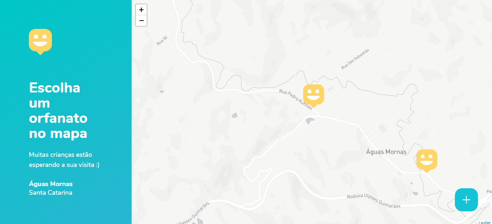
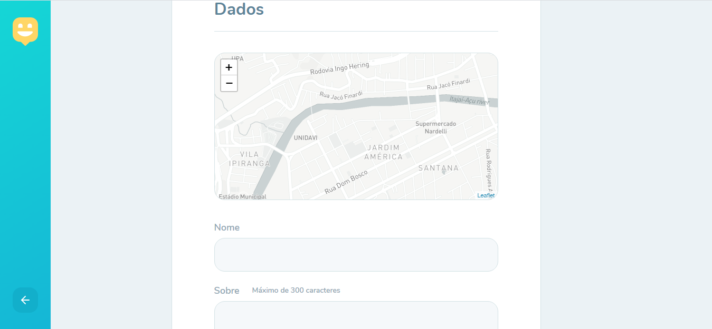
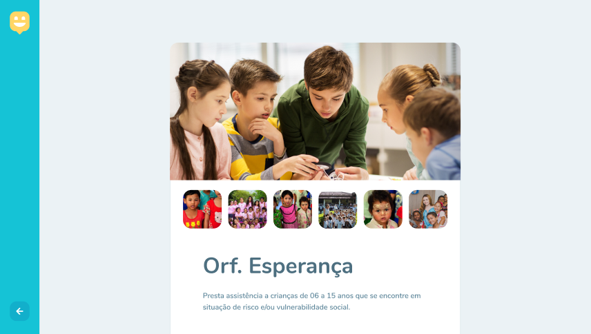
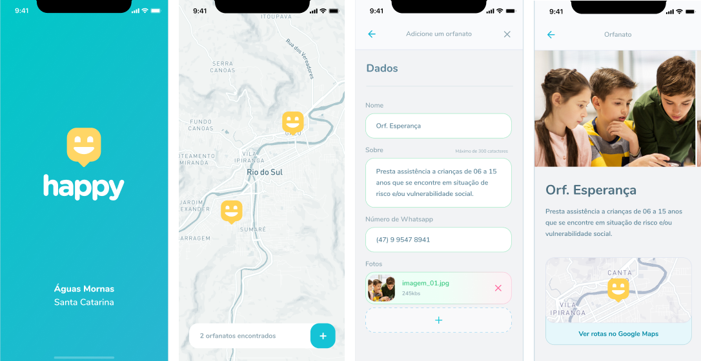

<h1 align="center">
    
</h1>

<p align="center"> 
  <a href="#-projeto">Projeto</a>&nbsp;&nbsp;&nbsp;|&nbsp;&nbsp;&nbsp;
  <a href="#-tecnologias">Tecnologias</a>&nbsp;&nbsp;&nbsp;|&nbsp;&nbsp;&nbsp;
  <a href="#-layout">Layout</a>&nbsp;&nbsp;&nbsp;|&nbsp;&nbsp;&nbsp;
  <a href="#-executando-a-aplicação-happy">Executando a aplicação Happy</a>&nbsp;&nbsp;&nbsp;|&nbsp;&nbsp;&nbsp;
  <a href="#gear-contribuição">contribuição</a>&nbsp;&nbsp;&nbsp;|&nbsp;&nbsp;&nbsp;
  <a href="#memo-licença">Licença</a>
</p>

## 💻 Projeto
Este projeto foi desenvolvido durante a 3º edição do evento Next Level Week - nlw-03 da [Rocketseat](https://rocketseat.com.br/).
O Happy é uma aplicação que conecta pessoas à casas de acolhimento institucional (Orfanatos) para fazer o dia de muitas crianças mais feliz! 😄 :heart:. A proposta teve como objetivo o desenvolvimento da aplicação para o ambiente web e mobile. A versão web foi finalizada, mas a versão mobile ainda vai ser desenvolvida.

## 📋 Tecnologias

O projeto foi desenvolvido com as seguintes tecnologias:

#### Web - Frontend:
- [ReactJS](https://reactjs.org)
- [Typescript](https://www.typescriptlang.org/)
- React Icons
- React Router Dom
- Leaflet 
- API do Mapbox 
- Axios

#### Backend:
- [NodeJS](https://nodejs.org/en/)
- Express
- [Typescript](https://www.typescriptlang.org/)
- Express Async Errors
- TypeORM
- SQLite
- Multer
- Yup
- Cors

#### Mobile:
- [React Native](https://facebook.github.io/react-native/)
- Typescript
- React Native Maps
- React Navigation
- React Navigation Stack
- [Expo](https://expo.io/)
 
## 🎨 Layout

### 💻 Web 

<p align="center">
  
  
   
   
</p>

### 📱 Mobile 
<p align="center">
  
</p>

## 💻 Executando a aplicação Happy

### Requisitos necessários

Para executar o projeto é necessário ter instalado em seu sistema:
- NodeJS
- Gerenciador de pacotes Npm ou Yarn 

### :octocat: Clonando o Repositório

```bash
$ git clone https://github.com/marioandre01/nlw-03-happy.git

# entre na pasta do projeto
$ cd nlw-03-happy
```
### 💻 Executando o Happy web

Entre na pasta web

```bash

$ cd web

```
Instale as dependências

```bash

$ yarn

# ou pelo npm
$ npm install

```

Execute a aplicação

```bash

$ yarn start

# ou pelo npm
$ npm start

```
### 🌐 Executando o Servidor

Entre na pasta backend

```bash

$ cd backend

```
Instale as dependências

```bash

$ yarn

# ou pelo npm
$ npm install

```

Execute o servidor

```bash

$ yarn dev

# ou pelo npm
$ npm dev
```

<!--
### 📱 Rodando o Happy mobile 

Entre na pasta

```bash

$ cd mobile

```
Instale as dependências

```bash

$ yarn

# ou, caso use npm

$ npm install

```

Rode o mobile

```bash

$ yarn start

# ou, caso use npm

$ npm start

```

Depois de fazer isso, irá abrir o metro bundler no seu navegador. A partir de agora você tem algumas opções para acessar o app.

#### 1 - Emulador Android
 Na página do metro bundler, clique em "Run on Android device/emulator" e espere carregar. Tenha em mente que é necessário ter passado pelo processo de instalação
 do android sdk, etc.

#### 2 - Emulador IOS
 Na página do metro bundler, clique em "Run on iOS simulator" e espere carregar.
 
#### 3 - Seu smartphone
 Baixe o aplicativo do Expo:
  - [iOS](https://itunes.apple.com/app/apple-store/id982107779)
  - [Android](https://play.google.com/store/apps/details?id=host.exp.exponent&referrer=www)
 
 Depois de baixar, volte a página do metro bundler e escaneie o QR Code com o app do Expo.

<br>

Se tudo deu certo, o app deve estar disponível agora! 👩🏽‍🔧
-->

## :gear: Contribuição

Para contribuir com esse projeto faça os seguintes passos:

- Faça um fork desse repositório.
- Crie uma branch com a sua feature: 
```bash
git checkout -b minha_feature
```
- Faça um commit das suas modificações: 
```bash
git commit -m 'feat: Minha nova feature
```
- Faça um push para a sua branch: 
```bash
git push origin minha_feature
```

## :memo: Licença

Esse projeto está sob a licença MIT. Veja o arquivo [LICENCE](./LICENCE.md) para mais detalhes.

