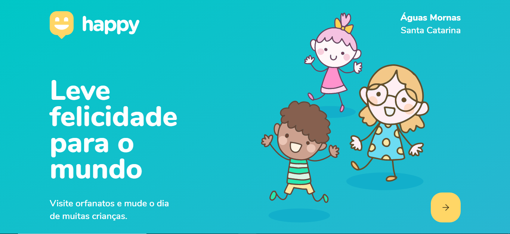
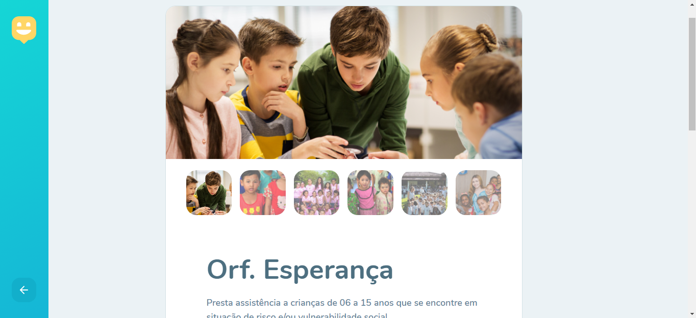

<h1 align="center">
    
</h1>

<p align="center"> 
  <a href="#-projeto">Projeto</a>&nbsp;&nbsp;&nbsp;|&nbsp;&nbsp;&nbsp;
  <a href="#-tecnologias">Tecnologias</a>&nbsp;&nbsp;&nbsp;|&nbsp;&nbsp;&nbsp;
  <a href="#-layout">Layout</a>&nbsp;&nbsp;&nbsp;|&nbsp;&nbsp;&nbsp;
  <a href="#-executando-a-aplicação-happy">Executando a aplicação Happy</a>&nbsp;&nbsp;&nbsp;|&nbsp;&nbsp;&nbsp;
  <a href="#-contribuição">contribuição</a>&nbsp;&nbsp;&nbsp;|&nbsp;&nbsp;&nbsp;
  <a href="#memo-licença">Licença</a>
</p>

## 💻 Projeto
Este projeto foi desenvolvido durante a 3º edição do evento Next Level Week - nlw-03 da [Rocketseat](https://rocketseat.com.br/).
O Happy é uma aplicação que conecta pessoas à casas de acolhimento institucional (Orfanatos) para fazer o dia de muitas crianças mais feliz! 😄 :heart:. A proposta teve como objetivo o desenvolvimento da aplicação para o ambiente web e mobile. A versão web foi finalizada, mas a versão mobile ainda vai ser desenvolvida.

## 📋 Tecnologias

O projeto foi desenvolvido com as seguintes tecnologias:

#### Web - Frontend:
- [ReactJS](https://reactjs.org)
- [Typescript](https://www.typescriptlang.org/)
- React Icons
- React Router Dom
- Leaflet 
- API do Mapbox 
- Axios

#### Backend:
- [NodeJS](https://nodejs.org/en/)
- Express
- [Typescript](https://www.typescriptlang.org/)
- Express Async Errors
- TypeORM
- SQLite
- Multer
- Yup
- Cors

#### Mobile:
- [React Native](https://facebook.github.io/react-native/)
- Typescript
- React Native Maps
- React Navigation
- React Navigation Stack
- [Expo](https://expo.io/)
 
## 🎨 Layout

### 💻 Web 

<p align="center">
  
  
   
   
</p>

### 📱 Mobile 
<p align="center">
  
</p>

## 💻 Executando a aplicação Happy

### Requisitos necessários

Para executar o projeto é necessário ter instalado em seu sistema:
- NodeJS
- Gerenciador de pacotes Npm ou Yarn 

### :octocat: Clonando o Repositório

```bash
$ git clone https://github.com/marioandre01/nlw-03-happy.git

# entre na pasta do projeto
$ cd nlw-03-happy
```
### 💻 Executando o Happy web

Entre na pasta web

```bash

$ cd web

```
Instale as dependências

```bash

$ yarn

# ou pelo npm
$ npm install

```

Execute a aplicação

```bash

$ yarn start

# ou pelo npm
$ npm start

```
### 🌐 Executando o Servidor

Entre na pasta backend

```bash

$ cd backend

```
Instale as dependências

```bash

$ yarn

# ou pelo npm
$ npm install

```

Execute o servidor

```bash

$ yarn dev

# ou pelo npm
$ npm dev

```
## ⚙️ Contribuição

Para contribuir com esse projeto faça os seguintes passos:

- Faça um fork desse repositório.
- Crie uma branch com a sua feature: 
```bash
git checkout -b minha_feature
```
- Faça um commit das suas modificações: 
```bash
git commit -m 'feat: Minha nova feature
```
- Faça um push para a sua branch: 
```bash
git push origin minha_feature
```

## :memo: Licença

Esse projeto está sob a licença MIT. Veja o arquivo [LICENCE](./LICENCE.md) para mais detalhes.

